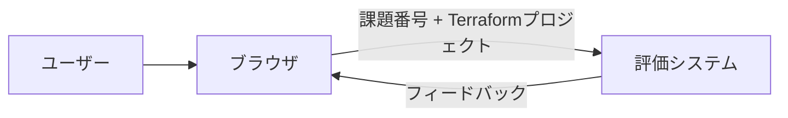
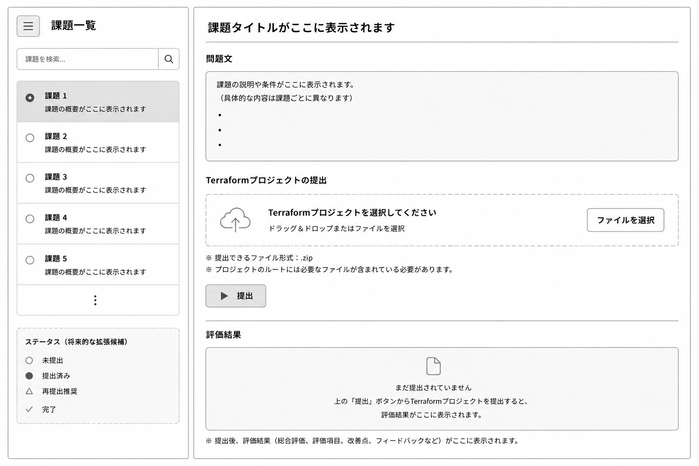

# AWS Architecture Evaluator

## 概要

aws学習者向けのaws設計ハンズオン学習システムです。
学習者は課題を選択してTerraformプロジェクトを提出し、
システムは提出内容を内部グラフへ変換し、課題に応じてAWS Well-Architected Framework等を基にした評価を行い、フィードバックを返します。

## 背景

AWSハンズオン学習では、
構成の正誤確認のために実際のAWS環境へのデプロイが必要になる場合があるが、AWSアカウント作成や料金への不安が学習障壁となりやすい。
なので本研究では、IaCファイルを入力として構成を静的に自動評価できる仕組みを開発します。

## 想定入力

- Terraform プロジェクト


## 想定出力

- スコア
- 問題点
- 改善提案

など

## 評価軸
- 課題準拠率
- セキュリティ
- 可用性
- コスト
- ベストプラクティス準拠率

## システム構成


### ディレクトリ構造案

```text
project/
├── frontend/      # UI・Webアプリケーション
├── backend/       # システムロジック
└── assignments/   # 課題データ・評価条件
```

## 画面構成案
```text
┌─────────────┬──────────────────────────────┐
│ 課題一覧     │ 課題タイトル                 │
│──────────── │─────────────────────────────│
│ □課題1      │ 問題文                       │
│ □課題2      │                             │
│ □課題3      │ Terraform Project           │
│             │ [提出]                      │
│             │                             │
│             │ Feedback                    │
└─────────────┴──────────────────────────────┘
```
chatgptに生成してもらった暫定案イメージ


## 使用予定技術

### フロントエンド
- HTML
- CSS
- HTMX(未確定)
- bootstrap(未確定)
### バックエンド
- Python
- FastAPI
  
## 開発状況

設計段階

## 今後の予定

2. 評価基準策定
  - 2.3 Well-Architected精査
  - 2.4 w-a IaC判定可能項目抽出
  - 2.5 CAIQとの対応付け
  - 2.6 評価対象決定
  - 2.7 重要度設定
  - 2.8 評価ルール設計

3. システム要件定義
  - 3.1 利用シナリオ作成
  - 3.3 出力データ定義
  - 3.4 評価結果表示方法設計
  - 3.5 改善提案方式設計

4. 評価エンジン開発
  - 4.1 Terraform等解析機能
  - 4.2 AWSリソース抽出
  - 4.3 評価ルール適用
  - 4.4 スコア算出
  - 4.5 フィードバック生成

5. Webシステム開発
  - 5.1 UI設計
  - 5.2 ファイルアップロード
  - 5.3 評価結果表示
  - 5.4 改善提案表示

6. 評価実験
  - 6.1 サンプル構成作成
  - 6.2 採点テスト
  - 6.3 評価妥当性検証
  - 6.4 改善提案妥当性検証

7. 発表資料作成
  - 7.1 研究背景整理
  - 7.2 提案手法整理
  - 7.3 実験結果整理
  - 7.4 考察
  - 7.5 発表資料作成
